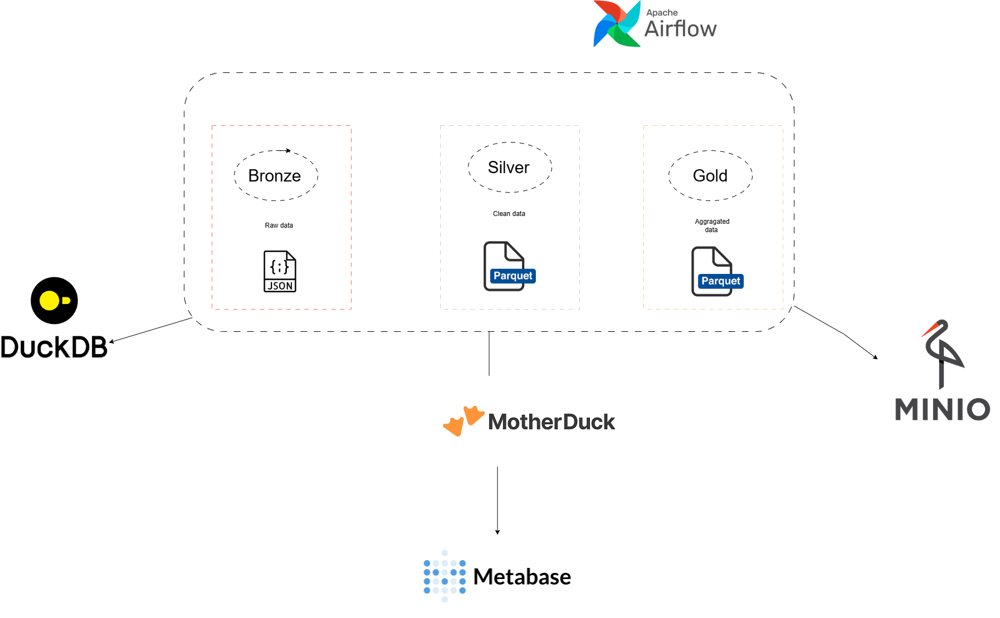
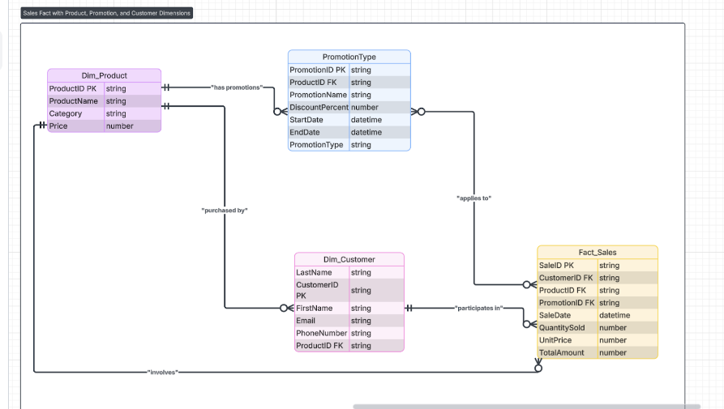

# Sales Pipeline

A data engineering pipeline implementing the **Medallion Architecture (Bronze → Silver → Gold)** using **Apache Airflow**, **Python**, **MinIO (S3-compatible storage)**, **DuckDB / MotherDuck**, and **Metabase**.

---


### Architecture Diagram



### ERD Diagram




## Quick Start

1. **Clone the repository**:

```bash
git clone https://github.com/kamogeloMogoba98/Data-project.git
cd Data-project
```

2. **Create the local environment file** from the example template:

```bash
cp .env.example .env
```

3. **Add your MotherDuck Token** to the `.env` file:

```plaintext
MOTHERDUCK_TOKEN=md_your_actual_token_here
```

4. **Initialize and start all Docker containers** (Airflow, MinIO, Metabase):

```bash
docker compose up -d
```

5. **Verify that all containers are running successfully**:

```bash
docker compose ps
```

6. **Check Airflow scheduler logs** to ensure DAGs are loading:

```bash
docker compose logs airflow-standalone -f
```

7. **Enter the Airflow container** if you need to inspect the local DuckDB file:

```bash
docker exec -it airflow-unified bash
ls -l /opt/airflow/airflow_home_dev/my_local.db
```

8. **Trigger the pipeline DAG** in Airflow:

- DAG Name: `pipeline`

```bash
airflow dags trigger pipeline
```

---

## Project UI Endpoints

- **Airflow UI:** http://localhost:8089
- **MinIO Console:** http://localhost:9001
- **Metabase:** http://localhost:3002

---

## Metabase Setup (DuckDB + MotherDuck)

After all containers are running, connect Metabase to DuckDB/MotherDuck to explore and visualize the **Gold** layer.

---

### Step 1: Log in to Metabase

1. Open Metabase in your browser:

http://localhost:3002

2. Log in using **your own Metabase credentials** (created on first launch).

---

### Step 2: Add a New Database

1. Go to **Settings → Admin → Databases**
2. Click **Add database**
3. Configure the database as follows:

---

### Database Configuration

**Database type**  
DuckDB (community-developed driver)

**Display name**  
dataproject

**Database file**  
`:memory:`

**Allow loading unsigned extensions**  
Enabled (required for MotherDuck)

**Read-only connection**  
Optional

---

### MotherDuck Token

Paste your **own MotherDuck token** (same one used in `.env`).

Do not commit this token to GitHub.

---

### Init SQL (Required)

```sql
INSTALL motherduck;
LOAD motherduck;
SET motherduck_token='<YOUR_MOTHERDUCK_TOKEN_HERE>';

ATTACH 'md:my_database' AS clouddb;
USE clouddb;
```

---

### Additional DuckDB Options

```plaintext
http_keep_alive=false
```

---

### Save and Verify

- Click **Save changes**
- Go to **Browse data → dataproject**
- Confirm `bronze`, `silver`, and `gold` schemas exist

If tables do not appear immediately, trigger the Airflow DAG and refresh Metabase metadata.

---

### Viewing Data in MotherDuck Environment

All processed data is stored inside the **MotherDuck cloud environment**.

- The Airflow pipeline writes data to the MotherDuck database:

```plaintext
my_database
```

- This database exists in your MotherDuck account
- You can query the same data from:
  - MotherDuck UI
  - Metabase
  - DuckDB CLI

Because Metabase connects using:

```sql
ATTACH 'md:my_database' AS clouddb;
USE clouddb;
```

all data displayed in Metabase comes directly from **MotherDuck `my_database`**.

Once inside Metabase, you can create rich dashboards, write queries against the tables, build questions, and visualize your business insights using charts, tables, and filters.

---

## Project Directory Structure

```
Data-project/
├── airflow_home_dev/
│   ├── dags/
│   │   ├── DimGenerators/
│   │   ├── DimJsonFiles/
│   │   ├── helper/
│   │   ├── table_insert/
│   │   └── Pipeline.py
│   └── my_local.db
├── .env
├── docker-compose.yaml
├── Dockerfile
├── Metabase.Dockerfile
├── README.md
└── requirements.txt
```

---

## Environment Variables

```plaintext
MOTHERDUCK_TOKEN=md_your_actual_token_here
```

Do not commit your real `.env` file.

---

## Data Model (Bronze → Silver → Gold)

- **Bronze:** Raw JSON stored in MinIO, DuckDB schema `bronze`
- **Silver:** Cleaned Parquet, DuckDB schema `silver`
- **Gold:** Aggregated analytics tables, DuckDB schema `gold` (`fact_sales`)

---

## Tools and Purpose

- **Apache Airflow:** DAG orchestration and scheduling
- **Python:** ETL and transformation logic
- **MinIO:** S3-compatible object storage
- **DuckDB / MotherDuck:** Analytical database engine
- **Metabase:** Business intelligence and dashboards

---

## Final Checklist Before You Push

- [ ] `.env.example` exists and is committed
- [ ] `.env` is ignored
- [ ] DAG loads successfully in Airflow UI
- [ ] Secrets are not hardcoded

---

## Author

**Kamogelo Mogoba**  
Data Engineer | LinkedIn: Kamogelo Mogoba

---

## License

This project is for learning and portfolio purposes.

